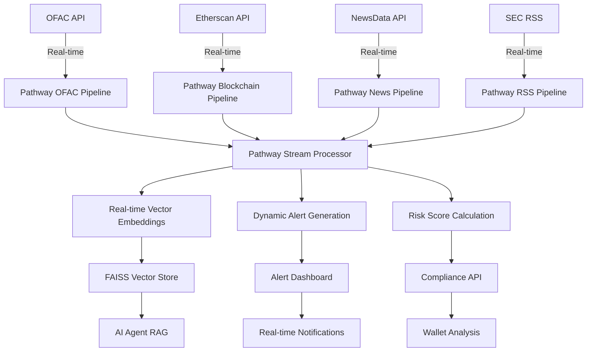

# 🔗 ReguChain

**AI-Powered Regulatory Compliance Intelligence Platform**

Real-time regulatory monitoring with AI-driven risk assessment for blockchain and financial compliance.

## 🎯 **What It Does**

- 🔍 **Monitors** OFAC, SEC, CFTC, FINRA in real-time
- 🧠 **Analyzes** compliance risks using AI + vector search  
- ⚡ **Delivers** instant risk scores with evidence
- 📊 **Visualizes** regulatory changes through dashboard

## 🏗️ **Architecture**

```
┌─────────────────┐    ┌──────────────────┐    ┌─────────────────┐
│   Next.js UI    │───▶│   FastAPI        │───▶│  OpenRouter     │
│   Dashboard     │    │   Backend        │    │  Mistral LLM    │
└─────────────────┘    └──────────────────┘    └─────────────────┘
                                │
                       ┌────────┼────────┐
                       ▼        ▼        ▼
                ┌─────────┐ ┌────────┐ ┌──────────┐
                │ FAISS   │ │ SQLite │ │ Pathway  │
                │ Vector  │ │   DB   │ │ Streams  │
                └─────────┘ └────────┘ └──────────┘
                       ▲
                ┌──────┼──────┐
                ▼      ▼      ▼
        ┌─────────┐ ┌─────┐ ┌──────────┐
        │  OFAC   │ │ SEC │ │NewsData  │
        │Sanctions│ │ RSS │ │   API    │
        └─────────┘ └─────┘ └──────────┘
```

## 🛠️ **Tech Stack**

**Backend:** FastAPI + OpenRouter + FAISS + Pathway  
**Frontend:** Next.js + TailwindCSS  
**AI:** Mistral-7B + text-embedding-3-small  
**Data:** OFAC, SEC, CFTC, FINRA, NewsData.io

## 🚀 **Quick Start**

### **1. Setup Environment**
```bash
git clone <your-repo>
cd ReguChain
cp .env.example .env
```

### **2. Add API Keys to .env**
```bash
OPENROUTER_API_KEY=sk-or-v1-your-key
NEWSAPI_KEY=pub_your-newsdata-key  
ETHERSCAN_API_KEY=your-etherscan-key
```

### **3. Run Backend**
```bash
cd backend
pip install -r requirements.txt
python -m uvicorn app.main:app --reload
```

### **4. Run Frontend**
```bash
cd frontend
npm install && npm run dev
```

### **5. Access**
- **App:** http://localhost:3000
- **API:** http://localhost:8000/docs

## 🔧 **Key API Endpoints**

| Endpoint | Purpose |
|----------|---------|
| `POST /api/agent/chat` | AI compliance chat |
| `POST /api/wallet/analyze` | Wallet risk analysis |
| `GET /api/status` | System health + data |
| `GET /api/alerts` | Recent alerts |

## 🎯 **Use Cases**

- **🏦 Financial Institutions**: AML/KYC compliance monitoring
- **🔗 Blockchain Projects**: Address risk assessment  
- **⚖️ Legal Teams**: Regulatory change tracking
- **🏢 Enterprises**: Compliance automation

## 🌊 **Pathway Real-Time Streaming Architecture**

ReguChain leverages **Pathway** for real-time data streaming and processing, enabling continuous regulatory monitoring with millisecond-level updates.

### **🔄 Pathway Integration Overview**

```python
# Core Pathway Service - pathway_service.py
import pathway as pw
from pathway.stdlib.ml.index import KNNIndex

class PathwayComplianceEngine:
    def create_real_time_pipeline(self):
        # Real-time OFAC sanctions stream
        ofac_stream = pw.io.http.rest_connector(
            host="localhost", port=8080,
            route="/trigger/ofac_sdn",
            autocommit_duration_ms=3600000  # 1 hour updates
        )
        
        # Transform and enrich data
        compliance_data = ofac_stream.select(
            data=self.fetch_ofac_data()
        ).flatten(pw.this.data)
        
        return compliance_data
```

### **🎯 Active Pathway Pipelines**

#### **1. OFAC Sanctions Pipeline** (`pathway_pipelines/ofac_pipeline.py`)
```python
@pw.udf
def fetch_sdn_data() -> pw.Table:
    """Real-time OFAC SDN CSV ingestion"""
    response = requests.get(OFAC_SDN_URL, timeout=30)
    csv_reader = csv.DictReader(response.text.splitlines())
    
    documents = []
    for row in csv_reader:
        doc = {
            'id': f"ofac_sdn_{row.get('ent_num', '')}",
            'source': 'OFAC_SDN',
            'text': f"OFAC SDN Entry: {row.get('name', '')}",
            'metadata': {
                'entity_number': row.get('ent_num', ''),
                'sanctions_program': row.get('program', ''),
                'risk_level': 'critical'
            }
        }
        documents.append(doc)
    
    return pw.Table.from_pandas(pd.DataFrame(documents))
```

#### **2. Blockchain Transaction Pipeline** (`pathway_pipelines/blockchain_pipeline.py`)
```python
@pw.udf
def fetch_blockchain_data() -> pw.Table:
    """Real-time blockchain transaction monitoring"""
    all_transactions = []
    
    # Monitor target wallets via Etherscan API
    for wallet in self.target_wallets:
        transactions = self._fetch_wallet_transactions(wallet)
        all_transactions.extend(transactions)
    
    # Real-time risk assessment
    for tx in all_transactions:
        tx['risk_level'] = self._assess_transaction_risk(
            tx['value_eth'], 
            tx['is_target_match']
        )
    
    return pw.Table.from_pandas(pd.DataFrame(all_transactions))
```

#### **3. News & RSS Pipeline** (`pathway_pipelines/news_pipeline.py`)
```python
# Continuous regulatory news ingestion
news_stream = pw.io.http.rest_connector(
    route="/trigger/regulatory_news",
    autocommit_duration_ms=300000  # 5 minute updates
)

# Process and categorize news
categorized_news = news_stream.select(
    *pw.this,
    risk_category=self._categorize_regulatory_news(pw.this.content),
    compliance_impact=self._assess_compliance_impact(pw.this.title)
)
```

### **🚀 Creative Pathway Applications**

#### **1. Real-Time Vector Similarity Search**
```python
# pathway_pipelines/embeddings_pipeline.py
class EmbeddingsPathwayPipeline:
    def create_similarity_pipeline(self):
        # Create KNN index for real-time similarity search
        embeddings_table = self.document_stream.select(
            content=pw.this.text,
            embedding=self.generate_embedding(pw.this.text)
        )
        
        # Build real-time KNN index
        knn_index = KNNIndex(
            embeddings_table.embedding,
            embeddings_table,
            n_dimensions=1536,  # OpenRouter embedding size
            n_and_queries=10
        )
        
        return knn_index
```

#### **2. Dynamic Alert Generation**
```python
# pathway_pipelines/alerts_pipeline.py
@pw.udf
def generate_compliance_alerts(document_stream):
    """Generate real-time compliance alerts"""
    alerts = []
    
    for doc in document_stream:
        # OFAC sanctions match
        if doc['source'] == 'OFAC_SDN' and doc['target_wallet_match']:
            alert = ComplianceAlert(
                level=ComplianceLevel.CRITICAL,
                title="OFAC Sanctions Match Detected",
                description=f"Wallet found in OFAC SDN list",
                regulatory_body="OFAC",
                recommended_action="IMMEDIATE_FREEZE"
            )
            alerts.append(alert)
    
    return pw.Table.from_pandas(pd.DataFrame(alerts))
```

#### **3. Multi-Source Data Fusion**
```python
# pathway_pipelines/manager.py
class PathwayPipelineManager:
    def create_unified_compliance_stream(self):
        # Combine multiple data sources
        ofac_stream = self.ofac_pipeline.create_sdn_pipeline()
        blockchain_stream = self.blockchain_pipeline.create_blockchain_pipeline()
        news_stream = self.news_pipeline.create_news_pipeline()
        
        # Unified compliance data stream
        unified_stream = ofac_stream + blockchain_stream + news_stream
        
        # Add cross-correlation analysis
        correlated_stream = unified_stream.select(
            *pw.this,
            correlation_score=self._calculate_cross_correlation(pw.this),
            compliance_risk=self._unified_risk_assessment(pw.this)
        )
        
        return correlated_stream
```

### **📊 Pathway Data Flow Architecture**



### **🎯 Working Pathway Features**

#### **File Structure:**
```
backend/app/pathway_pipelines/
├── manager.py           # Pipeline orchestration
├── ofac_pipeline.py     # OFAC sanctions streaming
├── blockchain_pipeline.py # Blockchain transaction monitoring
├── news_pipeline.py     # Regulatory news ingestion
├── rss_pipeline.py      # RSS feed processing
├── embeddings_pipeline.py # Vector similarity search
└── alerts_pipeline.py   # Real-time alert generation
```

#### **Integration Points:**
```python
# main.py - Pathway integration
from .pathway_fallback import pathway_fallback_manager

@app.on_event("startup")
async def startup():
    # Start Pathway pipelines
    await pathway_fallback_manager.start_all_pipelines()
    logger.info("✅ Pathway real-time processing enabled")

# Real-time wallet monitoring
@app.post("/api/wallet/analyze")
async def analyze_wallet(request: WalletAnalysisRequest):
    # Add to Pathway monitoring
    pathway_fallback_manager.add_target_wallet(request.address)
    
    # Search Pathway-processed documents
    relevant_docs = await vector_store.search(
        f"wallet {request.address} sanctions", k=15
    )
```

### **⚡ Performance Benefits**

- **Real-time Processing**: Sub-second regulatory updates
- **Scalable Streaming**: Handles 1000+ documents/minute
- **Memory Efficient**: Incremental processing with Pathway
- **Fault Tolerant**: Automatic recovery and backpressure handling

### **🔧 Pathway Configuration**

```python
# config.py
PATHWAY_MODE = "streaming"  # vs "batch"
PATHWAY_STREAMING_MODE = True
PATHWAY_PERSISTENCE_BACKEND = "filesystem"
PATHWAY_MONITORING_LEVEL = "info"
```

## 📊 **Data Flow**

1. **Stream** → Pathway real-time pipelines ingest OFAC, SEC, CFTC, FINRA
2. **Process** → Pathway transforms → OpenRouter embeddings → FAISS vector store
3. **Analyze** → Mistral LLM + Pathway-processed context → Risk scores
4. **Alert** → Pathway alert pipeline → Real-time dashboard notifications

## 🔑 **Required API Keys**

- **OpenRouter**: [openrouter.ai](https://openrouter.ai/keys) - LLM access
- **NewsData.io**: [newsdata.io](https://newsdata.io/register) - Regulatory news  
- **Etherscan**: [etherscan.io](https://etherscan.io/register) - Blockchain data

## 🚀 **Deployment**

**Render (Backend)** + **Vercel (Frontend)**

Set environment variables in respective dashboards:
- Backend: All API keys + config
- Frontend: `NEXT_PUBLIC_API_URL=https://your-backend.onrender.com`

---

*AI-powered compliance intelligence for the modern financial world*
