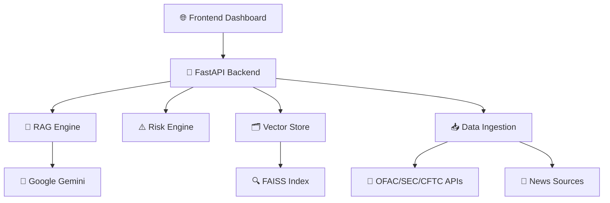

# 🔗 ReguChain Watch

> **AI-Powered Regulatory Compliance Intelligence Platform**

Transform regulatory compliance monitoring with real-time AI insights. ReguChain Watch continuously analyzes regulatory data from multiple sources, providing instant risk assessments and compliance intelligence through advanced RAG (Retrieval-Augmented Generation) technology.

---

## 🎯 **What It Does**

ReguChain Watch is an intelligent compliance monitoring system that:

- 🔍 **Monitors** regulatory sources (OFAC, SEC, CFTC, FINRA) in real-time
- 🧠 **Analyzes** compliance risks using AI-powered vector search
- ⚡ **Delivers** instant risk assessments with explainable evidence
- 📊 **Visualizes** risk scores and regulatory changes through an intuitive dashboard

---

## 🏗️ **System Architecture**

---

## ✨ **Core Features**

### 🔄 **Real-time Intelligence**
- Continuous regulatory data ingestion
- Live feed of compliance updates
- Instant risk score calculations (0-100)

### 🎯 **Smart Analysis**
- AI-powered semantic search
- Multi-source evidence correlation
- Explainable risk assessments

### 🚀 **Production Ready**
- Docker containerization
- Health monitoring & error handling
- Scalable cloud deployment

---

## 🛠️ **Technology Stack**

### **Backend Engine**
- **FastAPI** - High-performance API framework
- **Google Gemini** - Advanced AI embeddings & generation
- **FAISS** - Vector similarity search
- **SQLAlchemy** - Database ORM
- **SQLite** - Lightweight data storage

### **Frontend Interface**
- **Next.js 14** - Modern React framework
- **TailwindCSS** - Utility-first styling
- **React 18** - Component architecture

### **Infrastructure**
- **Docker** - Containerization
- **Render/Vercel** - Cloud deployment
- **GitHub Actions** - CI/CD pipeline

---

## 🎮 **Interactive Demo**

Experience the platform's capabilities:

1. **🔍 Query**: Ask about wallet compliance status
2. **⚡ Simulate**: Inject test sanctions data
3. **📊 Analyze**: Watch real-time risk score updates
4. **🔍 Explore**: Review evidence and recommendations

---

## 🌐 **API Endpoints**

| Endpoint | Purpose | Example |
|----------|---------|---------|
| `POST /api/query` | Compliance assessment | Risk analysis for addresses |
| `POST /api/ingest/simulate` | Demo data injection | Test sanctions scenarios |
| `GET /api/status` | System health | Platform status check |

---

## 🔧 **Configuration**

| Variable | Purpose | Required |
|----------|---------|----------|
| `GOOGLE_API_KEY` | Gemini AI access | ✅ Yes |
| `NEWSAPI_KEY` | News data source | ❌ Optional |
| `DATABASE_URL` | Data storage path | ✅ Yes |
| `FAISS_INDEX_PATH` | Vector index location | ✅ Yes |

---

## 🎯 **Use Cases**

- **🏦 Financial Institutions**: AML/KYC compliance monitoring
- **🔗 Blockchain Projects**: Address risk assessment
- **⚖️ Legal Teams**: Regulatory change tracking
- **🏢 Enterprises**: Compliance automation

---

## 📈 **Free Tier Limits**

- **Google Gemini**: 1,500 requests/day
- **NewsAPI**: 200 requests/day
- **RSS Feeds**: Unlimited government sources

---

*Built with ❤️ for intelligent compliance monitoring*
