# 🔗 ReguChain

> **AI-Powered Regulatory Compliance Intelligence Platform**

Transform regulatory compliance monitoring with real-time AI insights. ReguChain Watch continuously analyzes regulatory data from multiple sources, providing instant risk assessments and compliance intelligence through advanced RAG (Retrieval-Augmented Generation) technology.

---

## 🎯 **What It Does**

ReguChain Watch is an intelligent compliance monitoring system that:

- 🔍 **Monitors** regulatory sources (OFAC, SEC, CFTC, FINRA) in real-time
- 🧠 **Analyzes** compliance risks using AI-powered vector search
- ⚡ **Delivers** instant risk assessments with explainable evidence
- 📊 **Visualizes** risk scores and regulatory changes through an intuitive dashboard

---

## 🏗️ **System Architecture**

```mermaid
graph TB
    A[🌐 Frontend Dashboard] --> B[🔌 FastAPI Backend]
    B --> C[🤖 RAG Engine]
    B --> D[⚠️ Risk Engine]
    B --> E[🗂️ Vector Store]
    B --> F[📥 Data Ingestion]
    B --> G[⚡ Pathway Streaming]
    
    C --> H[🧠 Groq LLM]
    E --> I[🔍 FAISS Index]
    F --> J[📡 OFAC/SEC/CFTC APIs]
    F --> K[📰 News Sources]
    G --> L[🔄 Real-time Processing]
```

---

## ✨ **Core Features**

### 🔄 **Real-time Intelligence**
- Continuous regulatory data ingestion
- Live feed of compliance updates
- Instant risk score calculations (0-100)

### 🎯 **Smart Analysis**
- AI-powered semantic search
- Multi-source evidence correlation
- Explainable risk assessments

### 🚀 **Production Ready**
- Docker containerization
- Health monitoring & error handling
- Scalable cloud deployment
- **Pathway streaming** - Enterprise real-time data processing (optional)

---

## 🛠️ **Technology Stack**

### **Backend Engine**
- **FastAPI** - High-performance API framework
- **Groq/OpenRouter** - LLM for reasoning and analysis (supports multiple providers)
- **FAISS** - Vector similarity search
- **Pathway** - Real-time data streaming engine (wallet-centric streaming, requires license)
- **SQLAlchemy** - Database ORM
- **SQLite** - Lightweight data storage

### **Frontend Interface**
- **Next.js 14** - Modern React framework
- **TailwindCSS** - Utility-first styling
- **React 18** - Component architecture

### **Infrastructure**
- **Docker** - Containerization
- **Render/Vercel** - Cloud deployment
- **GitHub Actions** - CI/CD pipeline

---

## 🎮 **Interactive Demo**

Experience the platform's capabilities:

1. **🔗 Connect Wallet**: Connect your wallet to enable wallet-centric real-time monitoring
2. **⚡ Start Realtime**: Start the Pathway streaming pipeline (auto-starts if `PATHWAY_KEY` is set)
3. **🛰️ Stream**: Live wallet transactions and alerts stream into the dashboard
4. **🤖 Query**: Ask the AI about your wallet or recent regulations
5. **📊 Analyze**: Watch risk score updates and alerts in real time

---

## 🌐 **API Endpoints**

| Endpoint | Purpose | Notes |
|----------|---------|-------|
| `POST /api/agent/chat` | Conversational compliance assessment | Uses Groq/OpenRouter LLM |
| `POST /api/ingest/pdf` | Upload PDF reports | Enhances RAG knowledge base |
| `POST /api/ingest/refresh` | Refresh data ingestion | Pull latest news/regulatory feeds |
| `POST /api/realtime/start` | Start real-time processing | Begins Pathway streaming |
| `POST /api/realtime/stop` | Stop real-time processing | Stops Pathway streaming |
| `GET /api/realtime/health` | Real-time services health | Shows connected wallets and pipeline status |
| `GET /api/realtime/dashboard` | Realtime metrics | Includes wallet tx/alert counters |
| `POST /api/realtime/wallet/connect?wallet_address=0x...` | Connect wallet for realtime | Starts wallet monitoring |
| `GET /api/realtime/wallet/{wallet}/status` | Wallet realtime status | Live status for the connected wallet |
| `GET /api/realtime/wallet/{wallet}/compliance` | Compliance status | Up-to-date compliance snapshot |
| `GET /api/realtime/wallet/{wallet}/report` | Compliance report | Detailed report with verification info |
| `GET /api/realtime/wallet/tracked` | Tracked wallets | List wallets under monitoring |
| `GET /api/realtime/streams/{name}?wallet_address=0x...` | Stream records | Names: `realtime_news`, `processed_news`, `high_priority_news`, `critical_alerts`, `wallet_transactions`, `wallet_transactions_processed`, `wallet_alerts` |

---

## 🔧 **Configuration**

| Variable | Purpose | Required |
|----------|---------|----------|
| `GROQ_API_KEY` | Groq LLM access | ❌ Optional (or use OpenRouter) |
| `OPENROUTER_API_KEY` | OpenRouter LLM access | ❌ Optional (alternative to Groq) |
| `LLM_PROVIDER` | LLM provider selection | ❌ Optional (`groq` or `openrouter`) |
| `LLM_MODEL` | Specific model to use | ❌ Optional (e.g., `qwen/qwen2.5-7b-instruct`) |
| `NEWSAPI_KEY` | News data source (NewsAPI.org or NewsData.io) | ✅ Yes for news |
| `PATHWAY_KEY` | Real-time streaming license | ❌ Optional (fallback available) |
| `DATABASE_URL` | Data storage path | ✅ Yes |
| `FAISS_INDEX_PATH` | Vector index location | ✅ Yes |
| `ETHERSCAN_API_KEY` | Wallet tx source | ✅ Yes for wallet analysis |

---

## 🎯 **Use Cases**

- **🏦 Financial Institutions**: AML/KYC compliance monitoring
- **🔗 Blockchain Projects**: Address risk assessment
- **⚖️ Legal Teams**: Regulatory change tracking
- **🏢 Enterprises**: Compliance automation

---

## 📈 **Notes**

### **Real-time Processing**
- **Pathway streaming**: Optional with `PATHWAY_KEY`. Without it, pandas-based fallback processes the same data.
- **No mock data**: All responses use real APIs (NewsAPI, Etherscan, regulatory feeds).
- When a wallet connects, the system streams live transactions and emits processed alerts in real time.

### **LLM Configuration**
- **Groq**: Set `GROQ_API_KEY` for fast inference.
- **OpenRouter**: Set `OPENROUTER_API_KEY` for access to multiple models including Qwen.
- **Provider selection**: Use `LLM_PROVIDER=openrouter` to prefer OpenRouter even if Groq key exists.
- **Recommended**: `qwen/qwen2.5-7b-instruct` for structured outputs and compliance analysis.

### **Quality Guarantee**
- ✅ **No mock responses** - All data comes from real sources
- ✅ **Real-time news** - Live regulatory updates
- ✅ **Actual blockchain data** - Real transaction analysis
- ✅ **Transparent errors** - Clear messages when services are unavailable

---

*Built with ❤️ for intelligent compliance monitoring*
