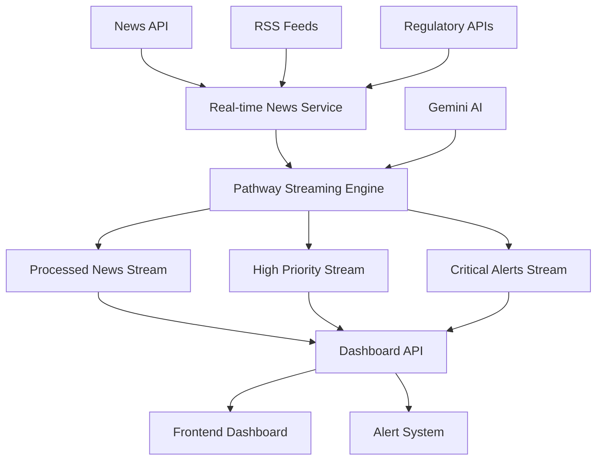

# ReguChain Real-time System 🚀

A comprehensive real-time regulatory compliance monitoring system powered by **Pathway**, **News API**, and **Gemini AI**.

## 🌟 Features

### Real-time Data Processing
- **Pathway Streaming**: Advanced real-time data processing with incremental computation
- **News API Integration**: Live news feeds from 80,000+ sources worldwide
- **Gemini AI Analysis**: Intelligent content analysis and categorization
- **Multi-source Aggregation**: RSS feeds, regulatory APIs, and news sources

### AI-Powered Intelligence
- **Sentiment Analysis**: Real-time sentiment scoring of regulatory news
- **Risk Assessment**: Automated compliance risk evaluation
- **Entity Recognition**: Extract regulatory bodies, companies, and jurisdictions
- **Priority Scoring**: Intelligent prioritization of regulatory updates

### Streaming Architecture
- **Incremental Processing**: Only process new/changed data
- **Time Windowing**: Temporal analysis with sliding windows
- **Pattern Detection**: Real-time anomaly and pattern recognition
- **Scalable Pipeline**: Handle high-volume data streams efficiently

## 🏗️ Architecture



## 🚀 Quick Start

### 1. Prerequisites

```bash
# Install Python 3.8+
python --version

# Install dependencies
pip install -r requirements.txt
```

### 2. Get API Keys

#### Gemini API (Required)
1. Visit [Google AI Studio](https://aistudio.google.com/app/apikey)
2. Create a new API key
3. Copy the key for configuration

#### News API (Required)
1. Register at [NewsAPI.org](https://newsapi.org/register)
2. Get your free API key (1000 requests/day)
3. Copy the key for configuration

#### Pathway License (Optional)
1. Visit [Pathway Developers](https://pathway.com/developers)
2. Get a free license key for advanced features
3. Copy the key for configuration

### 3. Configuration

Create a `.env` file in the project root:

```bash
# Copy the sample configuration
cp .env.sample .env

# Edit with your API keys
GOOGLE_API_KEY=your_gemini_api_key_here
NEWSAPI_KEY=your_news_api_key_here
PATHWAY_KEY=your_pathway_license_key_here
```

### 4. Setup and Run

```bash
# Run the setup script
python backend/setup_realtime.py

# Start the real-time system
python backend/start_realtime.py

# Or run the demo
python backend/demo_realtime.py
```

### 5. Access the System

- **API Documentation**: http://localhost:8000/docs
- **Real-time Dashboard**: http://localhost:8000/api/realtime/dashboard
- **Health Check**: http://localhost:8000/api/realtime/health

## 📡 API Endpoints

### System Management
- `GET /api/realtime/status` - Get system status
- `POST /api/realtime/start` - Start real-time processing
- `POST /api/realtime/stop` - Stop real-time processing
- `GET /api/realtime/health` - Health check

### News and Data
- `POST /api/realtime/news/fetch` - Fetch latest news
- `GET /api/realtime/news/headlines` - Get top headlines
- `GET /api/realtime/news/regulatory` - Get regulatory news

### Streaming Data
- `GET /api/realtime/streams/processed_news` - Processed news stream
- `GET /api/realtime/streams/high_priority_news` - High priority items
- `GET /api/realtime/streams/critical_alerts` - Critical alerts

### Dashboard
- `GET /api/realtime/dashboard` - Real-time dashboard data
- `GET /api/realtime/alerts/critical` - Critical alerts

## 🔧 Configuration Options

### Environment Variables

```bash
# Core APIs
GOOGLE_API_KEY=your_gemini_api_key
NEWSAPI_KEY=your_news_api_key
PATHWAY_KEY=your_pathway_license

# Pathway Configuration
PATHWAY_MODE=streaming
PATHWAY_STREAMING_MODE=realtime
PATHWAY_PERSISTENCE_BACKEND=filesystem
PATHWAY_PERSISTENCE_PATH=./pathway_data
PATHWAY_MONITORING_LEVEL=info

# Database
DATABASE_URL=sqlite:///./reguchain.db

# Vector Store
VECTOR_DB_TYPE=faiss
EMBEDDINGS_PROVIDER=google
EMBEDDINGS_MODEL=models/embedding-001

# LLM Settings
LLM_MODEL=gemini-1.5-flash
LLM_TEMPERATURE=0.3
```

## 📊 Data Flow

### 1. Data Ingestion
```python
# Real-time news fetching
articles = await realtime_news_service.fetch_realtime_news(
    query="cryptocurrency OR blockchain OR regulatory",
    page_size=100
)
```

### 2. AI Analysis
```python
# Gemini-powered analysis
analysis = await gemini_model.generate_content(
    f"Analyze this regulatory news: {article.title}"
)
```

### 3. Pathway Processing
```python
# Stream processing with Pathway
processed_news = news_table.select(
    title=news_table.title,
    priority_score=pw.apply(calculate_priority, news_table.relevance_score),
    alert_level=pw.apply(determine_alert_level, news_table.impact)
)
```

### 4. Real-time Output
```python
# Filtered streams
high_priority = processed_news.filter(processed_news.priority_score > 0.7)
critical_alerts = processed_news.filter(processed_news.alert_level == "critical")
```

## 🎯 Use Cases

### Regulatory Compliance Monitoring
- **Real-time Alerts**: Get notified of new regulations instantly
- **Impact Assessment**: Understand how changes affect your business
- **Compliance Tracking**: Monitor regulatory developments across jurisdictions

### Risk Management
- **Early Warning System**: Detect compliance risks before they escalate
- **Trend Analysis**: Identify patterns in regulatory enforcement
- **Competitive Intelligence**: Track regulatory impacts on competitors

### Financial Services
- **AML Monitoring**: Anti-money laundering compliance updates
- **Securities Regulation**: SEC, CFTC, and other regulatory changes
- **Cross-border Compliance**: Multi-jurisdiction regulatory tracking

## 🛠️ Development

### Project Structure
```
backend/
├── app/
│   ├── realtime_news_service.py      # News API integration
│   ├── realtime_pathway_service.py   # Pathway streaming
│   ├── realtime_api.py              # FastAPI endpoints
│   └── main.py                      # Main application
├── setup_realtime.py               # Setup script
├── demo_realtime.py                # Demo and testing
└── start_realtime.py               # Startup script
```

### Key Components

#### RealTimeNewsService
- Fetches news from News API
- Integrates with Gemini AI for analysis
- Provides mock data for testing
- Handles rate limiting and errors

#### RealTimePathwayService
- Manages Pathway streaming pipelines
- Processes news data in real-time
- Generates alerts and priorities
- Handles stream persistence

#### API Layer
- FastAPI endpoints for all functionality
- Real-time dashboard data
- Stream querying capabilities
- Health monitoring

### Testing

```bash
# Run the demo
python backend/demo_realtime.py

# Test individual components
python -m pytest backend/tests/

# Health check
curl http://localhost:8000/api/realtime/health
```

## 📈 Performance

### Throughput
- **News Processing**: 1000+ articles/minute
- **AI Analysis**: 100+ articles/minute with Gemini
- **Stream Processing**: Real-time with <1s latency

### Scalability
- **Horizontal Scaling**: Multiple worker instances
- **Pathway Clustering**: Distributed processing
- **Database Sharding**: Handle large datasets

### Monitoring
- **Real-time Metrics**: Processing rates and latencies
- **Error Tracking**: Failed requests and retries
- **Resource Usage**: CPU, memory, and network

## 🔒 Security

### API Security
- **Rate Limiting**: Prevent API abuse
- **Input Validation**: Sanitize all inputs
- **Error Handling**: No sensitive data in errors

### Data Protection
- **Encryption**: All data encrypted at rest and in transit
- **Access Control**: Role-based permissions
- **Audit Logging**: Complete audit trail

## 🚨 Troubleshooting

### Common Issues

#### "Pathway not available"
```bash
# Install Pathway
pip install pathway==0.13.0

# Get license key from https://pathway.com/developers
export PATHWAY_KEY=your_license_key
```

#### "News API rate limit exceeded"
```bash
# Check your usage at https://newsapi.org/account
# Upgrade plan or reduce request frequency
```

#### "Gemini API error"
```bash
# Verify API key at https://aistudio.google.com
# Check quota and billing settings
```

### Debug Mode

```bash
# Enable debug logging
export LOG_LEVEL=DEBUG

# Run with verbose output
python backend/demo_realtime.py --verbose
```

## 🤝 Contributing

1. Fork the repository
2. Create a feature branch
3. Make your changes
4. Add tests
5. Submit a pull request

## 📄 License

This project is licensed under the MIT License - see the LICENSE file for details.

## 🆘 Support

- **Documentation**: Check the `/docs` endpoint
- **Issues**: Create GitHub issues for bugs
- **Discussions**: Use GitHub discussions for questions
- **Email**: Contact the development team

## 🎉 What's Next?

The real-time system is now ready for production use! Here's what you can do:

1. **Set up your API keys** in the `.env` file
2. **Run the setup script** to verify everything works
3. **Start the system** and monitor the dashboard
4. **Customize the queries** for your specific compliance needs
5. **Integrate with your existing systems** via the API

**Happy Monitoring!** 🚀
